# TransitOps – Smart Transport Operations Platform

A comprehensive fleet, driver, dispatch, maintenance, and fuel/expense management platform built for the Odoo Hackathon 2026. Designed with React, Node.js, and PostgreSQL.

**🌍 Live Demo:** [https://transitops-mu-six.vercel.app/](https://transitops-mu-six.vercel.app/)

---

## 🔧 Tech Stack


- **Frontend**: React.js, Tailwind CSS, TypeScript, Vite
- **Backend**: Node.js, Express.js, TypeScript
- **Database**: PostgreSQL (with Prisma ORM)
- **Other Tools**: Docker Compose, Zod, PDFKit, Recharts

---

## 🚀 Features

### 🏢 Fleet & Maintenance (Fleet Manager)
- Manage vehicle fleet (CRUD operations, retire vehicles).
- Track maintenance records and schedule services.
- Real-time vehicle status tracking (`Available`, `On Trip`, `In Shop`).

### 🚚 Dispatch & Trips (Driver / Dispatcher)
- Browse and track active/pending trips.
- Manage trip lifecycle (`Draft` → `Dispatched` → `Completed/Cancelled`).
- Auto-validation for cargo weight vs capacity.

### 🛡️ Safety & Compliance (Safety Officer)
- Monitor driver compliance and safety scores.
- Flag expiring licenses and suspend/reinstate drivers.

### 💰 Financials & Analytics (Financial Analyst)
- Log fuel usage and track standalone expenses (tolls, misc).
- View operational costs, fleet utilization, and ROI charts.
- Export reports to CSV and PDF.

### ⚙️ Platform Core
- Role-Based Access Control (RBAC) enforced on both frontend and backend routes.
- Automatic status transitions via database transactions.
- Hot-reloading Docker development environment.

### 🌐 Full-Stack Integration (Final Update)
- Replaced hardcoded mock data across all modules with real API integrations.
- Connected the Dashboard, Fleet, Maintenance, Trips, and Expenses pages to their respective backend endpoints.
- Ensured data consistency across all 4 role-based views.

---

## 📁 Folder Structure
```
transitops/
├── docker-compose.yml       # DB and App services configuration
├── Dockerfile.dev           # Single dev image for backend + frontend
├── .env.example             # Environment variables template
├── backend/
│   ├── prisma/
│   │   ├── schema.prisma    # Database schema
│   │   └── seed.ts          # Seed data with demo users
│   ├── src/
│   │   ├── index.ts         # Express entrypoint
│   │   ├── modules/         # auth, vehicles, drivers, trips, maintenance, etc.
│   │   ├── middleware/      # auth, rbac, error-handler
│   │   └── utils/           # csv/pdf export helpers
│   └── package.json
└── frontend/
    ├── src/
    │   ├── main.tsx
    │   ├── App.tsx
    │   ├── pages/           # Auth, Dashboard, Fleet, Drivers, Trips, etc.
    │   ├── components/ui/   # Shared UI components
    │   └── lib/             # API client modules
    ├── vite.config.ts
    └── package.json
```

---

## 🛠️ Setup Instructions

### 📦 Prerequisites & Environment
Ensure you have Docker and Docker Compose installed.

```bash
# Copy the environment file
cp .env.example .env
```

### 🚀 Running with Docker
The platform runs backend and frontend as hot-reloading processes inside a single container.

```bash
# Build and start the containers
docker compose up --build

# Run database migrations
docker compose exec app sh -c "cd backend && npx prisma migrate dev"

# Seed the database with demo users
docker compose exec app sh -c "cd backend && npx prisma db seed"
```

### 🌐 Accessing the App
- **Frontend**: http://localhost:5173
- **Backend API**: http://localhost:4000
- **Postgres**: localhost:5432 (credentials in `.env`)

### 🔑 Demo Logins
All seeded users share the password `password123`.

| Role | Email |
|---|---|
| Fleet Manager | `fleet.manager@transitops.demo` |
| Driver / Dispatcher | `driver@transitops.demo` |
| Safety Officer | `safety.officer@transitops.demo` |
| Financial Analyst | `finance@transitops.demo` |

---

## 🎨 UI / UX Designs

A quick visual walkthrough of the **TransitOps Platform** application.

### 🔐 Authentication
| Signup | Login |
|------------|------------|
| 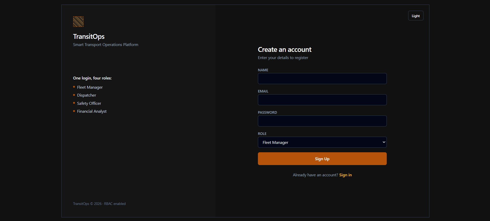 | 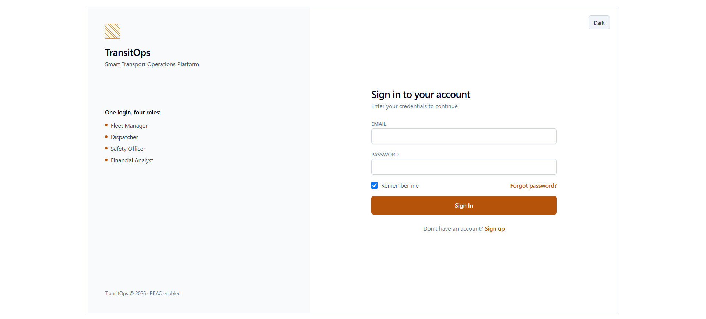 |

---

### 🏠 Dashboard & Trips
| Dashboard | Active Trips |
|------------------|------------|
| 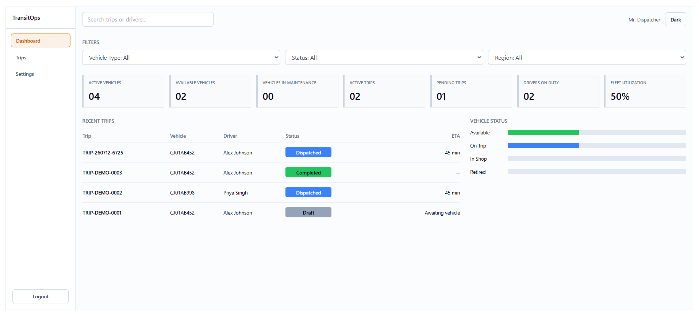 | 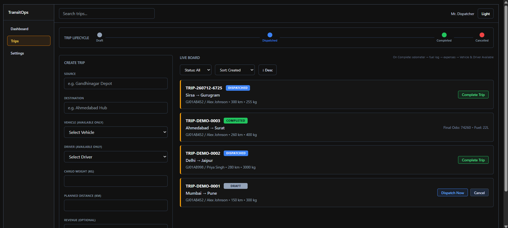 |

---

### 🚚 Fleet & Maintenance
| Fleet Management | Maintenance |
|------------------|------------|
| 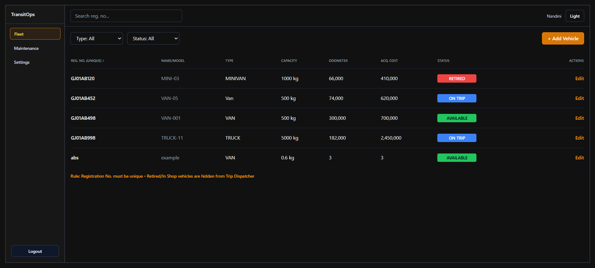 | 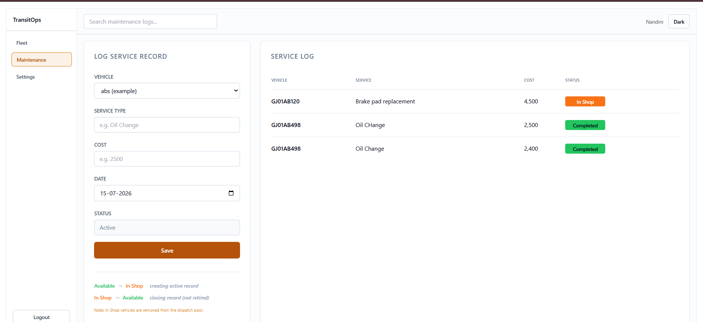 |

---

### 🛡️ Drivers & Compliance
| Drivers | Compliance |
|------------|------------|
| 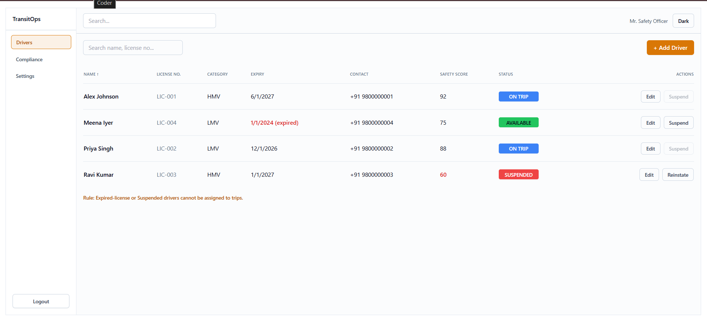 | 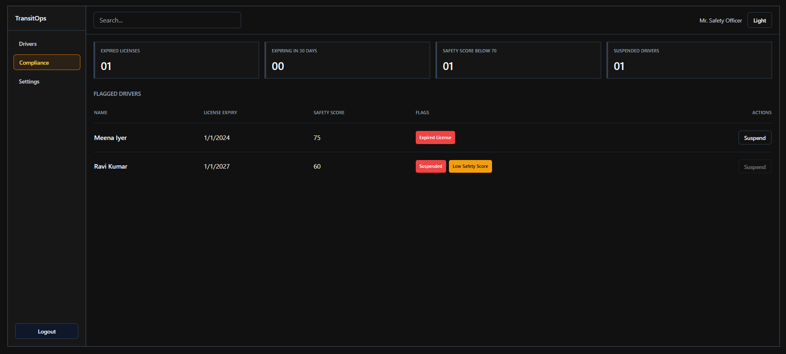 |

---

### 💰 Analytics & Fuel
| Financial Reports | Fuel Management |
|------------|------------|
| 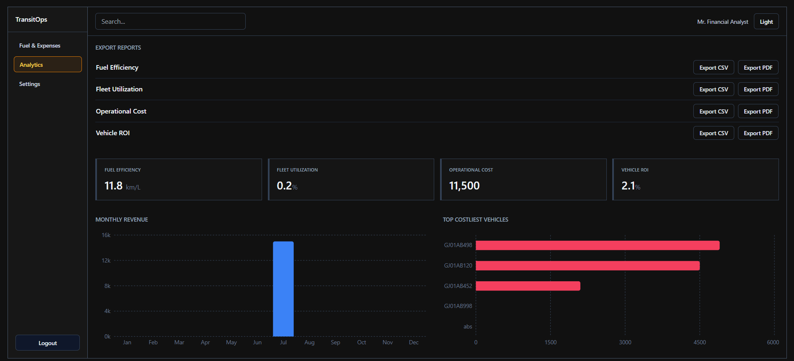 | 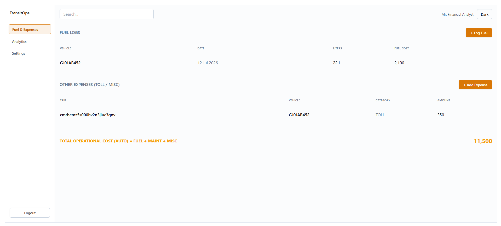 |

---

### ⚙️ Settings
| Settings (Dark) | Settings (Light) |
|------------|------------|
| 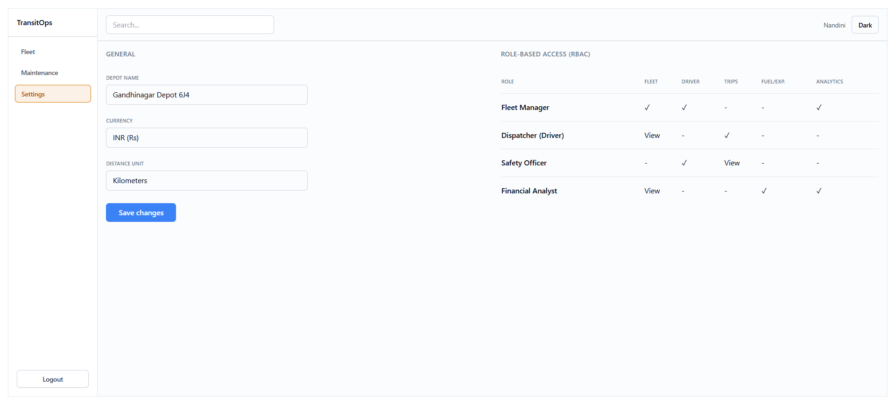 | 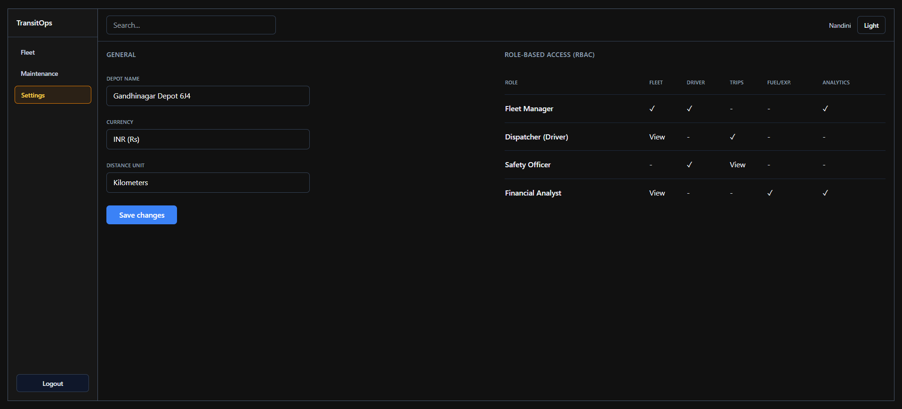 |

---

## 📌 Future Enhancements

- Add real-time GPS tracking for active trips.
- Automated email/SMS alerts for upcoming maintenance.
- Dedicated mobile application for drivers.
- Advanced AI-based route optimization.

## 🧑💻 Author

- **Nandini** – [GitHub Profile](https://github.com/Nandini-Sha)
- **Ved Patel** – [GitHub Profile](https://github.com/Veddp28)
  
## 📄 License

This project is licensed under the [MIT License](LICENSE).
